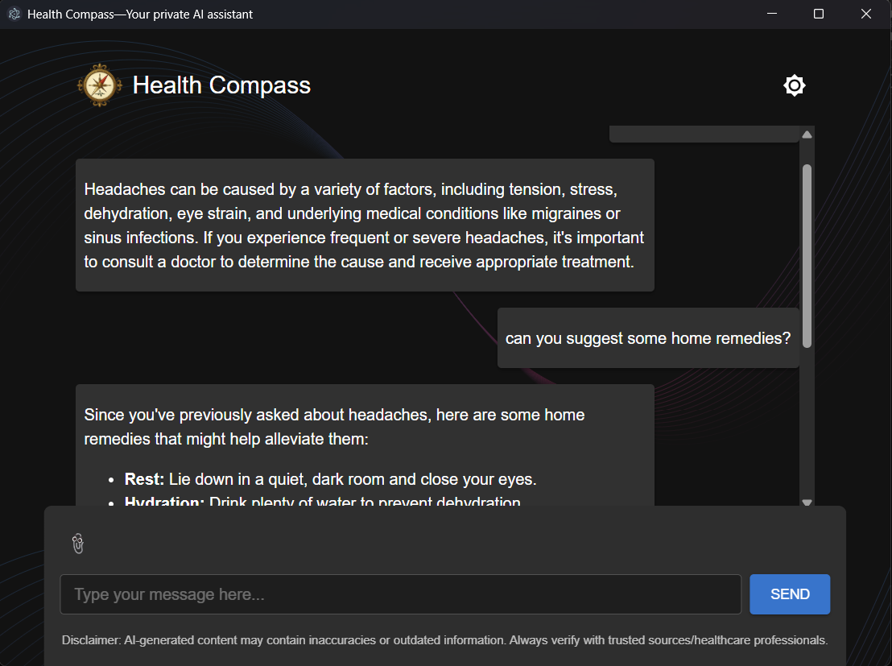

# Health Compass


Health Compass is a local-first, AI-powered desktop application designed to help you manage and understand your health data. Chat with a privacy-focused AI to log metrics, query your health history, and get easy-to-understand explanations of your lab reports. You can do all these with just a computer that has a CPU, even if you don't have a GPU.

With Health Compass, navigate your health in the right direction!

## ✨ Features

- **AI-Powered Chat**: Use natural language to interact with your health data.
- **Health Metric Logging**: Easily log various metrics such as blood pressure, blood sugar, weight, sleep duration, and heart rate.
- **Data Querying**: Retrieve your logged metrics with simple questions. Supports filtering and aggregations (average, min, max, count).
- **PDF Report Analysis**: Upload a medical lab report (PDF) and get a simple explanation of the key findings.
- **Local & Private**: All your data is stored locally on your machine in a SQLite database. No cloud services, no data sharing.
- **Powered by Ollama**: Leverages local large language models (LLMs) through [Ollama](https://ollama.com/) for all AI capabilities, ensuring your conversations remain private.
- **Cross-Platform**: Works on Windows, macOS, and Linux.




# ⚙️ How It Works

Health Compass is built with modern web technologies in a desktop container:

- **`Electron`**: Provides the cross-platform desktop application shell.
- **`React + Vite`**: Powers the user interface for a fast and responsive experience.
- **`Ollama`**: Runs local LLMs to understand user queries and generate responses.
- **`SQLite`**: Stores all health data locally in a single database file on your computer.

## 💻 Recommended IDE Setup

- [VSCode](https://code.visualstudio.com/) + [ESLint](https://marketplace.visualstudio.com/items?itemName=dbaeumer.vscode-eslint) + [Prettier](https://marketplace.visualstudio.com/items?itemName=esbenp.prettier-vscode)

## 📋 Prerequisites

Health Compass relies on two external software components to function correctly: Ollama for AI capabilities and Poppler for PDF analysis. Please ensure they are installed and configured before running the application.

### 1. Ollama

Ollama is required to run the local large language models that power the AI chat.

1. Download and install Ollama from the official website: [https://ollama.com/](https://ollama.com/)
2. Once installed, pull a model for the application to use, for example, `gemma3n:e2b`:
 ```bash
    ollama pull gemma3n:e2b
 ```
3. Ensure the Ollama server is running before you start Health Compass. The application will attempt to start it, but it's best to run it manually the first time.

### 2. PDF Text Extraction (`pdftotext`)

For analyzing PDF lab reports, Health Compass requires the `pdftotext` command-line tool, which is part of the [Poppler](https://poppler.freedesktop.org/) library.

Follow the instructions below for your specific operating system:

**macOS**

You can install it using Homebrew:

```bash
brew install poppler
```

**Ubuntu / Debian**

You can install it using `apt`:

```bash
sudo apt-get update
sudo apt-get install poppler-utils
```

**Windows**

1. Go to the [Poppler for Windows releases page](https://github.com/oschwartz10612/poppler-windows/releases) and download the latest binary (`.zip` file).
2. Unzip the downloaded file (e.g., to `C:\poppler-24.02.0-0`).
3. Add the `bin/` directory from the unzipped folder to your system's `PATH` environment variable. This allows the `pdftotext` command to be found from your terminal.

Alternatively, visit the [XpdfReader website](https://www.xpdfreader.com/download.html) and download the zip archive under the "Download the Xpdf command line tools" section. Extract the archive and add the location of the `bin/` directory to `PATH`.

To verify that `pdftotext` is properly installed, open a terminal and enter `pdftotext -v`. You should see the version information.

## 🚀 Project Setup

### Install

```bash
npm install
```

### Development

```bash
npm run dev
```

### Build

```bash
# For Windows
npm run build:win

# For macOS
npm run build:mac

# For Linux
npm run build:linux
```

### Set Default LLM (or SLM)

Create a `.env` file in the project root directory and set the LLM (via Ollama) you want to use, for example:
```
VITE_LLM_MODEL=gemma3n:e2b
```

When you run `npm run dev`, you can verify from the logs in the terminal that the specified LLM is used.

For even faster CPU inference, you can use `gemma3:1b`. However, `gemma3n:2b` and `gemma3n:4b` seem to have better instruction-following capabilities.


# 🙏 Acknwoledgement

Health Compass has been developed using [Gemini](https://gemini.google.com/), [Aider](https://aider.chat/), and [GitHub Copilot](https://github.com/features/copilot).
