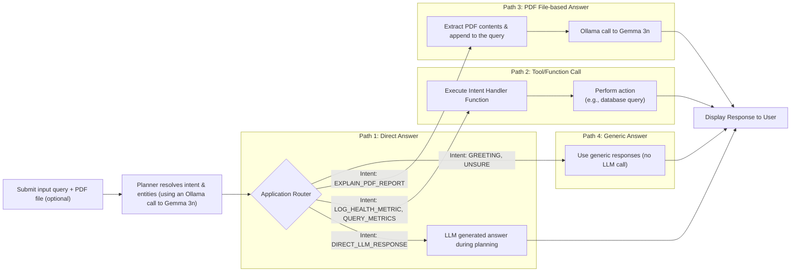
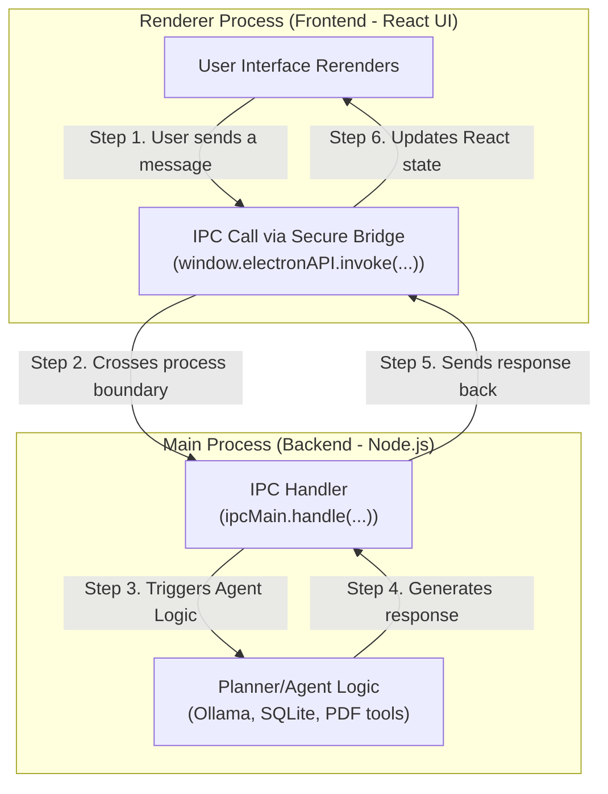

# Health Compass


Health Compass is a local, offline, AI-powered desktop application designed to help you manage and understand your health data. Chat with a privacy-focused AI to log metrics, query your health history, and get easy-to-understand explanations of your lab reports. You can do all these with just a computer that has a CPU, even if you don't have a GPU.

With Health Compass, navigate your health in the right direction!

## ✨ Features

- **AI-Powered Chat**: Use natural language to interact with your health data.
- **Health Metric Logging**: Easily log various metrics such as blood pressure, blood sugar, weight, sleep duration, and heart rate.
- **Data Querying**: Retrieve your logged metrics with simple questions. Supports filtering and aggregations.
- **PDF Report Analysis**: Upload a medical lab report (PDF) and get a simple explanation of the key findings.
- **Local & Private**: Your data never leaves your computer. No cloud services, no data sharing.
- **Powered by Ollama**: Leverages local Large Language Models (LLMs) or Small Language Models (SLMs) through [Ollama](https://ollama.com/) for all AI capabilities, ensuring your conversations remain private.
- **Cross-Platform**: Works on Windows, macOS, and Linux.


# 🔧 Installation and Usage

**Recommended IDE Setup**

- [VSCode](https://code.visualstudio.com/) + [ESLint](https://marketplace.visualstudio.com/items?itemName=dbaeumer.vscode-eslint) + [Prettier](https://marketplace.visualstudio.com/items?itemName=esbenp.prettier-vscode)

## 📋 Prerequisites

Health Compass relies on two external software components to function correctly: Ollama for AI capabilities and Poppler for PDF analysis. Please ensure they are installed and configured before running the application.

### 1. Ollama

Ollama is required to run the local large language models that power the AI chat.

1. Download and install Ollama from the official website: [https://ollama.com/](https://ollama.com/)
2. Once installed, pull a model for the application to use, for example, `gemma3n:e2b`:

```bash
    ollama pull gemma3n:e2b
```

3. Ensure the Ollama server is running before you start Health Compass. The application will attempt to start it, but it's best to run it manually the first time.

### 2. PDF Text Extraction (`pdftotext`)

For analyzing PDF lab reports, Health Compass requires the `pdftotext` command-line tool, which is part of the [Poppler](https://poppler.freedesktop.org/) library.

Follow the instructions below for your specific operating system:

**macOS**

You can install it using Homebrew:

```bash
brew install poppler
```

**Ubuntu / Debian**

You can install it using `apt`:

```bash
sudo apt-get update
sudo apt-get install poppler-utils
```

**Windows**

1. Go to the [Poppler for Windows releases page](https://github.com/oschwartz10612/poppler-windows/releases) and download the latest binary (`.zip` file).
2. Unzip the downloaded file (e.g., to `C:\poppler-24.02.0-0`).
3. Add the `bin/` directory from the unzipped folder to your system's `PATH` environment variable. This allows the `pdftotext` command to be found from your terminal.

Alternatively, visit the [XpdfReader website](https://www.xpdfreader.com/download.html) and download the zip archive under the "Download the Xpdf command line tools" section. Extract the archive and add the location of the `bin/` directory to `PATH`.

To verify that `pdftotext` is properly installed, open a terminal and enter `pdftotext -v`. You should see the version information.

## 🚀 Project Setup

### Install

```bash
npm install
```

### Development

```bash
npm run dev
```

### Build

```bash
# For Windows
npm run build:win

# For macOS
npm run build:mac

# For Linux
npm run build:linux
```

### Set Default LLM (Dev env only)

In your development environment, create a `.env` file in the project root directory and set the LLM (via Ollama) you want to use, for example:

```
VITE_LLM_MODEL=gemma3n:e2b
```

When you run `npm run dev`, you can verify from the logs in the terminal that the specified LLM is used. You can also verify the model that Ollama is currently using by running the `ollama ps` command, which would show the model(s) loaded.

```
NAME           ID              SIZE      PROCESSOR    CONTEXT    UNTIL
gemma3n:e2b    719372f8c7de    5.8 GB    100% CPU     4096       4 minutes from now
```

For even faster CPU inference, you can use `gemma3:1b`. However, `gemma3n:2b` and `gemma3n:4b` seem to have better instruction-following capabilities. Therefore, Gemma 3n is recommended.

### Pre-built Binaries

Pre-built (unsigend) installation files are available on GitHub. You can usem them to install Health Compass on Windows. You must install Ollama separately.

**NOTE: When you install Health Compass via the installation (.exe) file, the installed app will use `gemma3n:2b` by default**.

## ⚙️ How It Works

Health Compass is built with modern Web technologies in a desktop container:

- **`Electron`**: Provides the cross-platform desktop application shell.
- **`React + Vite`**: Powers the user interface for a fast and responsive experience.
- **`Ollama`**: Runs local LLMs to understand user queries and generate responses.
- **`SQLite`**: Stores all health data locally in a single database file on your computer.

# 🏢 Architecture

Health Compass employs a "Planner," powered entirely by local [Gemma 3n SLM via Ollama](https://ollama.com/library/gemma3n). This design ensures both privacy and functionality, allowing the application to understand user intent and take appropriate actions without data ever leaving the user's machine.

## High-Level AI-Powered Workflow

The core of the application's intelligence lies in its two-step process for handling user queries. This approach is heavily inspired by [Plan-and-Execute](https://blog.langchain.com/planning-agents/) agentic AI patterns as well as [Intent-based Networks](https://ieeexplore.ieee.org/document/9865738) [and Systems](https://ieeexplore.ieee.org/document/10067032).

Health Compass sends the input queries to the Planner. The Planner is responsible for deciding _what to do_—or rather, what the user _intends_ to do. Subsequently, based on this "plan," an appropriate intent-handling function is invoked.

1.  **Intent Resolution (The "Planner")**: The Planner's responsibility is to analyze the input query (along with conversation history) and determine the user's intent, based on a list of pre-defined intents. It outputs a structured JSON object containing the `intent` and any relevant `entities` (e.g., dates, metric types, and values). This step is crucial for transforming unstructured natural language into a machine-readable action plan. [Gemma 3n](https://developers.googleblog.com/en/introducing-gemma-3n-developer-guide/) is a very capable model that can appropriately identify the underlying intents and entities.

2.  **Intent Handling (The "Executor")**: The Executor module is responsible for taking an appropriate action, based on the intent identified. It receives a JSON object from the Planner and uses it to route the request to the correct handler function.
    - For a simple `DIRECT_LLM_RESPONSE` intent, the answer generated by the planner is immediately returned to the user.
    - For more complex intents like `LOG_HEALTH_METRIC` or `QUERY_METRICS`, the corresponding handler function is invoked. This function uses the extracted entities to perform specific actions, such as writing to or reading from the local **SQLite database**.
    - For `EXPLAIN_PDF_REPORT`, the handler first uses the `pdftotext` tool to extract text from the specified PDF, then passes this text to another **Ollama** call with a specialized prompt to generate a simplified explanation.

This flow is illustrated below:



## Intents and Optimization

Working with SLMs on CPU offers unique challenges not typically faced with larger LLMs hosted online. That is one of the reasons why Health Compass takes an intent-based approach. Currently, six intents are supported: `DIRECT_LLM_RESPONSE`, `EXPLAIN_PDF_REPORT`, `LOG_HEALTH_METRIC`, `QUERY_METRICS`, `GREETING`, and `UNSURE`. These intents define the scope of what this AI assistant or agent can do.

In addition, certain optimizations are also applied to improve the efficieny:

- In case of the `GREETING` and `UNSURE` intents, pre-defined responses are provided, reducing another SLM call to just say hello.
- When a user atatches a PDF file, the `EXPLAIN_PDF_REPORT` is triggered without asking the SLM to identify the intent, saving CPU resources and reducing latency. Of course, the response is generated by the SLM.
- The chat history length is limited in order to prevent a potential context overflow.

## Electron Application Structure

Health Compass is built on the Electron framework, which allows us to create a desktop application using web technologies like React. Electron's architecture separates the application into two main processes:

- **Main Process**: A full Node.js environment that serves as the application's backend. It manages windows, handles all interactions with the operating system (like file dialogs), and performs core logic such as database operations (`SQLite`), PDF processing, and making calls to the **Ollama** server. All intent handlers reside in this process.
- **Renderer Process**: A standard Chromium web browser environment that renders the user interface. Our UI is built with **React**. For security, this process is sandboxed and cannot directly access the file system or other Node.js APIs.

Communication between these two processes is handled securely via **Inter-Process Communication (IPC)**, bridged by a `preload` script. This ensures that the UI (Renderer) can only trigger predefined actions in the backend (Main), preventing arbitrary code execution and maintaining a clear, secure separation of concerns.



# 🙏 Acknowledgements

Health Compass has been developed using [Gemini](https://gemini.google.com/), [Aider](https://aider.chat/), and [GitHub Copilot](https://github.com/features/copilot). The Health Compass logo is generated using [Copilot](https://copilot.microsoft.com/).
